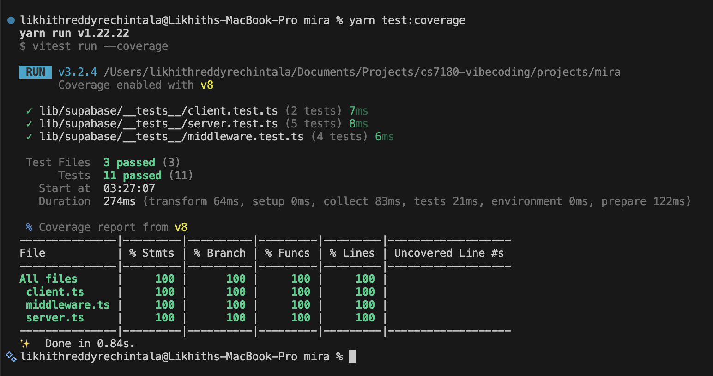

# MIRA - Mock Interview and Response Analyzer
### HW4: Claude Code Workflow & TDD

| Field | Detail |
|---|---|
| **Team Members** | Likhith Reddy Rechintala, Jaya Sriharshita Koneti |
| **Course** | CS 7180 |
| **Branch** | `homework-4` |
| **Feature Implemented** | S1-04 - Supabase SSR client integration |

---

## Part 1 - CLAUDE.md & Project Setup

| Deliverable | File |
|---|---|
| CLAUDE.md (tech stack, architecture, conventions, testing strategy, do's/don'ts) | [`CLAUDE.md`](./CLAUDE.md) |
| `@import` reference to PRD | [`CLAUDE.md` line 7](./CLAUDE.md) → imports [`project-memory/PRD.md`](./project-memory/PRD.md) |
| Permissions configuration (allow/ask/deny lists) | [`.claude/settings.json`](./.claude/settings.json) |
| `/init` output + CLAUDE.md iteration session | [`claude-conversations/claude-rules-file-init-and-iterate.txt`](./claude-conversations/claude-rules-file-init-and-iterate.txt) |

---

## Part 2 - Explore → Plan → Implement → Commit

| Phase | File |
|---|---|
| Explore - findings from Glob/Grep/Read + `@supabase/ssr` docs | [`docs/explorations/S1-04-exploration.md`](./docs/explorations/S1-04-exploration.md) |
| Explore - session log (2 parallel agents, 63 tool calls) | [`claude-conversations/explore.txt`](./claude-conversations/explore.txt) |
| Plan - full implementation plan (function signatures, test cases, commit sequence) | [`docs/plans/S1-04-plan.md`](./docs/plans/S1-04-plan.md) |
| Plan - session log | [`claude-conversations/plan.txt`](./claude-conversations/plan.txt) |
| Implement + Commit - session log | [`claude-conversations/implement-commit-ai-tdd-workflow.txt`](./claude-conversations/implement-commit-ai-tdd-workflow.txt) |

### Git commits showing the workflow

```
32984c0  [#S1-04] chore: add exploration notes for Supabase SSR client setup   ← Explore
7e7ca87  [#S1-04] chore: add implementation plan for Supabase SSR client        ← Plan
2ba79f6  [#S1-04] test: add failing unit tests for Supabase SSR client factories ← Implement (red)
73c2143  [#S1-04] feat: implement lib/supabase/client.ts browser client          ← Implement (green)
7f62992  [#S1-04] feat: implement lib/supabase/server.ts server client           ← Implement (green)
e395173  [#S1-04] feat: implement lib/supabase/middleware.ts session refresh helper
8596f5f  [#S1-04] chore: add types/supabase.ts Database type stub
d58c888  [#S1-04] test: expand server.test.ts to cover cookie getAll/setAll callbacks ← Refactor
```

---

## Part 3 - TDD with Claude Code

### Test files (written before implementation)

| Test File | What it covers |
|---|---|
| [`lib/supabase/__tests__/client.test.ts`](./lib/supabase/__tests__/client.test.ts) | `createClient()` returns a Supabase client with `auth`; does not throw |
| [`lib/supabase/__tests__/server.test.ts`](./lib/supabase/__tests__/server.test.ts) | `createClient()` calls `cookies()`; returns client with `auth`; cookie `getAll`/`setAll` delegation; Server Component error swallowing |
| [`lib/supabase/__tests__/middleware.test.ts`](./lib/supabase/__tests__/middleware.test.ts) | `updateSession()` returns `NextResponse`; calls `getUser()` exactly once; cookie `getAll` reads from request; `setAll` writes to request and response |

### Implementation files

| File | Purpose |
|---|---|
| [`lib/supabase/client.ts`](./lib/supabase/client.ts) | Browser-side Supabase client (`createBrowserClient`) for Client Components |
| [`lib/supabase/server.ts`](./lib/supabase/server.ts) | Server-side Supabase client (`createServerClient`) for Server Components and Route Handlers |
| [`lib/supabase/middleware.ts`](./lib/supabase/middleware.ts) | `updateSession()` - session refresh helper called on every request via `middleware.ts` |
| [`types/supabase.ts`](./types/supabase.ts) | `Database` type stub (placeholder until schema is generated via `supabase gen types`) |

### Red → Green → Refactor commit sequence

| Commit | State | Description |
|---|---|---|
| `2ba79f6` | Red | Failing tests committed before any implementation |
| `73c2143` `7f62992` `e395173` | Green | One implementation file per commit; all tests pass |
| `d58c888` | Refactor | Expanded server tests to cover cookie callbacks; coverage threshold restored |

### Test coverage (11 tests, 100% across all implementation files)



---

## Part 4 - Reflection

| Deliverable | File |
|---|---|
| Reflection document (workflow comparison, context management, annotated session logs) | [`reflection.md`](./reflection.md) |
| Session log - CLAUDE.md setup and `/init` | [`claude-conversations/claude-rules-file-init-and-iterate.txt`](./claude-conversations/claude-rules-file-init-and-iterate.txt) |
| Session log - Explore phase | [`claude-conversations/explore.txt`](./claude-conversations/explore.txt) |
| Session log - Plan phase | [`claude-conversations/plan.txt`](./claude-conversations/plan.txt) |
| Session log - Implement, Commit, TDD | [`claude-conversations/implement-commit-ai-tdd-workflow.txt`](./claude-conversations/implement-commit-ai-tdd-workflow.txt) |
